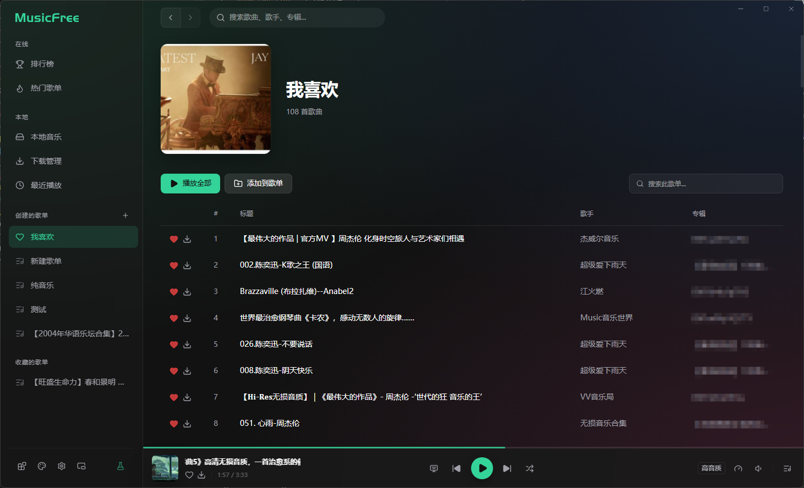
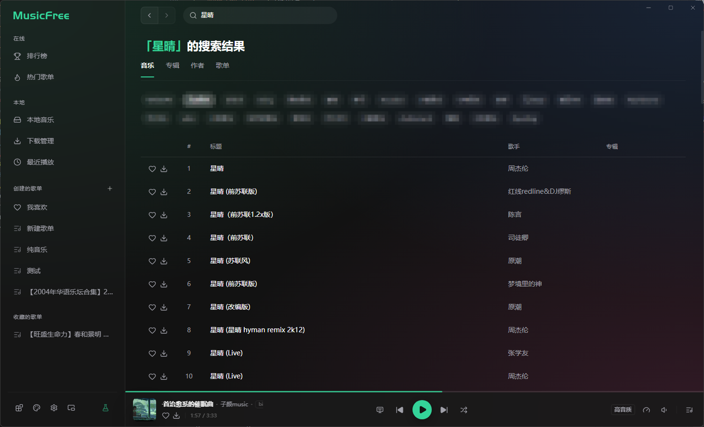
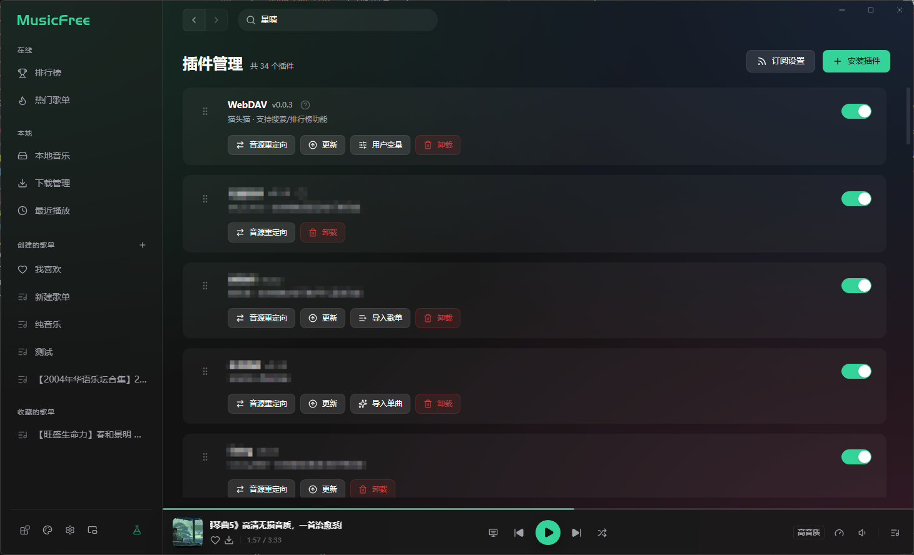
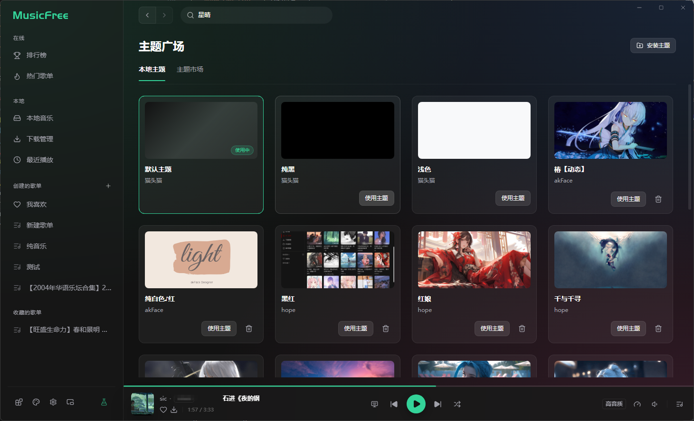
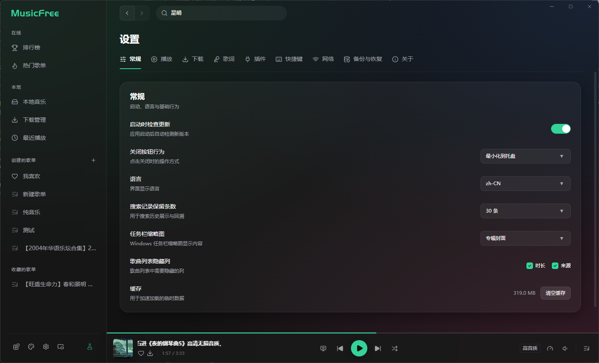

<div align="center">

# 🎵 MusicFree 桌面版

**插件化、定制化、无广告的免费音乐播放器**

**[English](./README_EN.md)** | 简体中文

</div>

---

> **本仓库说明**
>
> 基于 MusicFree 修改｜原作者：猫头猫｜修改者：不甚解

> [!IMPORTANT]
> **项目使用约定**
>
> 本项目基于 [AGPL 3.0](./LICENSE) 协议开源，使用与分发请遵守该协议，并保留协议文件与源码中的版权声明。
>
> 1. 打包、二次分发请保留代码出处（本仓库地址：https://github.com/bqsj404/MusicFreeDesktop-sj）
> 2. 请合法合规使用代码
> 3. 如果开源协议变更，将在此仓库更新，不另行通知
>
> <!-- 待补充：你自己的额外约定 -->

---

## ✨ 简介

一个插件化、定制化、无广告的免费音乐播放器，支持 **Windows**、**macOS** 和 **Linux**。

### 📥 下载

👉 [GitHub Releases](https://github.com/bqsj404/MusicFreeDesktop-sj/releases)


---

## 🚀 特性

|     特性      | 说明                                                                                                                                                                     |
| :-----------: | ------------------------------------------------------------------------------------------------------------------------------------------------------------------------ |
| **🔌 插件化** | 本软件仅仅是一个播放器，本身**不集成**任何平台的任何音源。所有搜索、播放、歌单导入等功能全部基于**插件**——只要互联网上有对应音源的插件，你都可以用本软件进行搜索和播放。 |
| **🎨 定制化** | 通过主题包自定义软件外观与背景，支持全新的语义化 CSS 变量系统和 iframe 背景。详见下方 [主题包](#-主题包) 章节。                                                          |
| **🚫 无广告** | 基于 AGPL 3.0 协议开源，将会保持免费。                                                                                                                                   |
|  **🔒 隐私**  | 所有数据存储在本地，不会上传你的个人信息。                                                                                                                               |

**插件支持的功能**：搜索（音乐、专辑、作者、歌单）、播放、查看专辑、查看作者详情、导入单曲、导入歌单、获取歌词、排行榜、推荐歌单、歌曲评论、多音质切换（标准 / 高品 / 超品 / 无损）。

---

## 🔌 插件

MusicFree 的核心能力由插件驱动。插件协议与 MusicFree 安卓版保持兼容，桌面版在此基础上扩展了更多能力。

### 插件仓库

- **示例插件**：链接解析_v1.0.2.js —— [网页看代码](https://github.com/bqsj404/MusicFreePlugins-sj/blob/main/plugins/链接解析_v1.0.2.js) ｜ [raw 直接装](https://raw.githubusercontent.com/bqsj404/MusicFreePlugins-sj/main/plugins/链接解析_v1.0.2.js)
- **开发文档**：待补充

<!-- 待补充：你自己的插件仓库地址与插件开发文档地址 -->

### 插件能力一览

```
搜索 ─── 音乐 / 专辑 / 作者 / 歌单
播放 ─── 多音质切换 · 音源重定向
内容 ─── 专辑详情 · 作者作品 · 歌词 · 歌曲评论
发现 ─── 排行榜 · 推荐歌单 · 歌单分类
导入 ─── 单曲导入 · 歌单导入
```

### 插件沙箱

插件运行在安全沙箱中，可使用以下内置模块：

`axios` · `cheerio` · `dayjs` · `big-integer` · `qs` · `he` · `crypto-js` · `webdav`

---

## 🎨 主题包

MusicFree 支持通过主题包自定义界面外观。内置两套主题：**浅色** 和 **纯黑（AMOLED）**。

### 主题包结构

一个主题包是一个文件夹（或 `.mftheme` 压缩包），包含以下文件：

```
my-theme/
├── config.json      # 主题配置（必需）
├── index.css        # 样式定义（必需）
├── preview.png      # 预览图（可选）
└── iframes/         # iframe 背景（可选）
    └── app.html
```

### config.json

```jsonc
{
    "name": "主题名称", // 必需
    "preview": "#000000", // 预览色或图片路径
    "description": "主题描述",
    "author": "作者",
    "authorUrl": "https://...",
    "version": "1.0.0",
    "srcUrl": "https://...", // 远程更新地址
    "thumb": "@/thumb.png", // 缩略图
    "blurHash": "LEHV6nWB2yk8pyo...", // 加载占位（BlurHash）
    "iframe": {
        "app": "@/iframes/app.html", // 软件整体背景
    },
}
```

> 路径中使用 `@/` 表示主题包根目录。

### index.css — 语义化 CSS 变量系统

新版采用 **语义化 CSS 变量** 设计，按视觉用途分为六大类。你可以在 `index.css` 中覆盖这些变量来定义主题色彩：

|   分类   |        前缀        | 用途                      | 示例                                               |
| :------: | :----------------: | ------------------------- | -------------------------------------------------- |
| **背景** |   `--color-bg-*`   | 页面、侧栏、弹窗等背景色  | `--color-bg-base`、`--color-bg-sidebar`            |
| **填充** |  `--color-fill-*`  | 按钮、交互元素的填充色    | `--color-fill-brand`、`--color-fill-neutral-hover` |
| **文本** |  `--color-text-*`  | 各级文本颜色              | `--color-text-primary`、`--color-text-secondary`   |
| **边框** | `--color-border-*` | 分割线、边框              | `--color-border-default`、`--color-border-subtle`  |
| **状态** | `--color-status-*` | 信息 / 警告 / 危险 / 成功 | `--color-status-danger-text`                       |
| **阴影** |    `--shadow-*`    | 各级投影                  | `--shadow-sm`、`--shadow-lg`                       |

> 完整变量列表请参考内置主题 [`res/builtin-themes/light/index.css`](./res/builtin-themes/light/index.css)。

### iframe 背景

通过 `config.json` 中的 `iframe.app` 字段，你可以将任意 HTML 页面设为软件背景，实现粒子、动画等纯 CSS 无法实现的效果。支持本地 HTML 文件和远程 URL。

### 主题包示例

示例仓库：待补充

---

## 🛠️ 启动项目

### 环境要求

|  依赖   |       版本       |
| :-----: | :--------------: |
| Node.js | >= 22.12 |
|  pnpm   |      >= 11       |

### 快速开始

```bash
# 克隆仓库（换成你自己的仓库地址）
git clone https://github.com/bqsj404/MusicFreeDesktop-sj.git
cd MusicFreeDesktop-sj

# 安装依赖
pnpm install

# 启动应用
pnpm start

# 需要 DevTools 时（默认不自动打开）
pnpm run start:devtools
```

### 常用命令

|           命令            | 说明                                          |
| :-----------------------: | --------------------------------------------- |
|        `pnpm start`       | 启动应用                                      |
| `pnpm run start:devtools` | 启动并自动打开 DevTools                       |
|      `pnpm run package`   | 打包免安装目录（`out/`）                      |
|       `pnpm run make`     | 构建安装包（Windows 无 make 目标，用 package）|
|       `pnpm run lint`     | 代码检查                                      |
|      `pnpm run format`    | 代码格式化                                    |

---

## 🤝 参与贡献

欢迎参与贡献！请阅读 [贡献指南](./CONTRIBUTING.md) 了解开发规范与提交流程。

---

## 📸 截图

#### 主页



#### 搜索



#### 插件管理



#### 主题广场



#### 设置



#### 迷你模式

<div align="center">


</div>

---

<!-- 待补充：你自己的支持方式 / 联系方式（微信公众号、B 站、小红书等） -->
